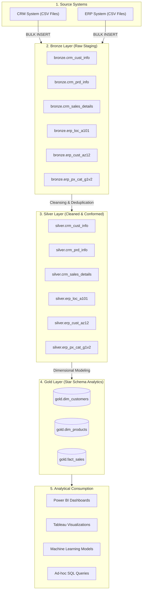
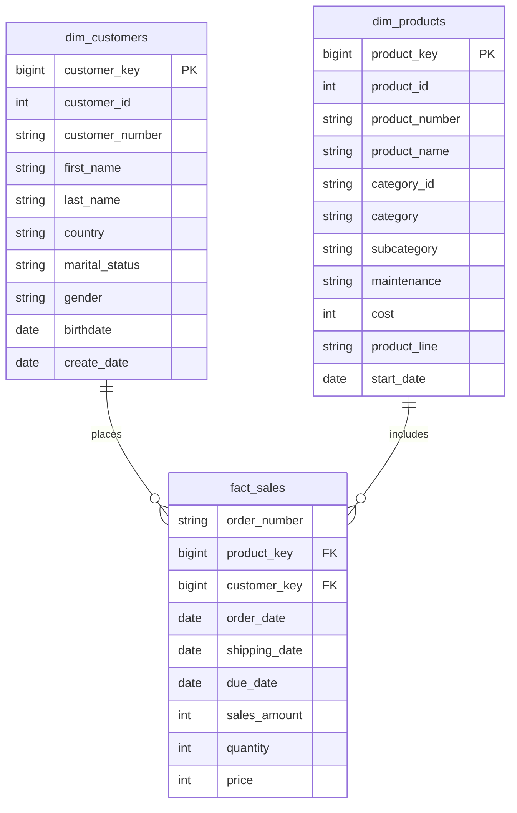

# Modern SQL Data Warehouse — Medallion Architecture

[](https://www.microsoft.com/en-us/sql-server)
[](https://docs.microsoft.com/en-us/sql/t-sql/)
[-00C7B7?style=for-the-badge)](https://learn.microsoft.com/en-us/azure/databricks/lakehouse/medallion)
[](https://en.wikipedia.org/wiki/Star_schema)
[](https://powerbi.microsoft.com/)
[](LICENSE)

---

## Overview

**Engineered an end-to-end SQL data warehouse via Medallion Architecture to clean, model, and serve curated data for analytics.**

- **Medallion Architecture:** Devised a modern SQL Data Warehouse using Medallion Architecture (Bronze-Silver-Gold) in SQL Server, structured across **5 ETL stages**.
- **Robust Pipelines:** Implemented Extract-Transform-Load pipelines in SQL Server Express, processing ERP and CRM data (CSV) developing **10+ SQL Modules**.
- **Star Schema Modeling:** Modeled star schema in the Gold Layer to enable fast SQL queries and seamless integration with **Power BI**, **Tableau**, and **Machine Learning** applications.
- **Data Quality:** Automated data testing suites asserting surrogate key uniqueness, referential integrity, and domain constraints.

---

## Clone Repository

```bash
git clone https://github.com/severed-brain/Data_Warehouse.git
cd Data_Warehouse
```

---

## System Architecture



---

## Star Schema Data Model

The Gold Layer is structured as an analytical **Star Schema** with conformed dimensions and surrogate keys:



---

## 5 ETL Pipeline Stages

| Stage | Stage Name | Scripts | Purpose |
| :---: | :--- | :--- | :--- |
| **1** | **Database & Schemas** | [`init_database.sql`](scripts/init_database.sql) | Initializes the `DataWarehouse` database with isolated `bronze`, `silver`, and `gold` schemas. |
| **2** | **Bronze Ingestion** | [`ddl_bronze.sql`](scripts/bronze/ddl_bronze.sql)<br/>[`proc_load_bronze.sql`](scripts/bronze/proc_load_bronze.sql) | DDL definition and dynamic `BULK INSERT` loading of 6 raw CRM and ERP CSV datasets with execution logging. |
| **3** | **Silver Cleansing** | [`ddl_silver.sql`](scripts/silver/ddl_silver.sql)<br/>[`proc_load_silver.sql`](scripts/silver/proc_load_silver.sql) | Deduplication, SCD end-date computation, data type casting, and heterogeneous key standardization. |
| **4** | **Gold Star Schema** | [`ddl_gold.sql`](scripts/gold/ddl_gold.sql) | Star schema dimensional views with surrogate key generation and active record filtering. |
| **5** | **Quality & Analytics** | [`quality_checks_*.sql`](tests/)<br/>[`analytics_queries.sql`](scripts/gold/analytics_queries.sql) | Automated data testing assertions and business intelligence SQL queries for reporting. |

---

## Engineering Highlights

### 1. Customer Deduplication with Window Functions
Selects the most recent customer record using creation timestamps:
```sql
SELECT cst_id, cst_key, TRIM(cst_firstname) AS cst_firstname, TRIM(cst_lastname) AS cst_lastname,
       CASE WHEN UPPER(TRIM(cst_marital_status)) = 'S' THEN 'Single'
            WHEN UPPER(TRIM(cst_marital_status)) = 'M' THEN 'Married'
            ELSE 'n/a' END AS cst_marital_status,
       cst_create_date
FROM (
    SELECT *, ROW_NUMBER() OVER (PARTITION BY cst_id ORDER BY cst_create_date DESC) AS flag_last
    FROM bronze.crm_cust_info
    WHERE cst_id IS NOT NULL
) t
WHERE flag_last = 1;
```

### 2. SCD Product Version Validity Dates
Computes product lifecycle end dates dynamically using `LEAD()`:
```sql
CAST(
    LEAD(prd_start_dt) OVER (PARTITION BY prd_key ORDER BY prd_start_dt) - 1 
    AS DATE
) AS prd_end_dt
```

### 3. Defensive Arithmetic & Anomaly Correction
Recalculates missing, zero, or negative sales metrics:
```sql
CASE 
    WHEN sls_sales IS NULL OR sls_sales <= 0 OR sls_sales != sls_quantity * ABS(sls_price) 
        THEN sls_quantity * ABS(sls_price)
    ELSE sls_sales
END AS sls_sales
```

### 4. Cross-System Key Standardization
Harmonizes heterogeneous ERP and CRM codes:
- Strips legacy `'NAS'` prefixes: `SUBSTRING(cid, 4, LEN(cid))`
- Normalizes hyphenated IDs: `REPLACE(cid, '-', '')`
- Maps country codes (`'DE'` &rarr; `'Germany'`, `'US'/'USA'` &rarr; `'United States'`)

---

## Project Structure

```text
├── datasets/                                 # Sample CSV datasets
│   ├── source_crm/                           # Customer, product, and sales data
│   │   ├── cust_info.csv
│   │   ├── prd_info.csv
│   │   └── sales_details.csv
│   └── source_erp/                           # Demographics, locations, and categories
│       ├── cust_az12.csv
│       ├── loc_a101.csv
│       └── px_cat_g1v2.csv
├── docs/                                     # Technical documentation
│   ├── architecture.md                       # Medallion Architecture design doc
│   ├── data_catalog.md                       # Enterprise data dictionary
│   └── etl_pipeline.md                       # Pipeline execution runbook
├── scripts/                                  # SQL modules & stored procedures
│   ├── init_database.sql                     # Database & schema creation
│   ├── bronze/                               # Bronze staging scripts
│   │   ├── ddl_bronze.sql
│   │   └── proc_load_bronze.sql
│   ├── silver/                               # Silver transformation scripts
│   │   ├── ddl_silver.sql
│   │   └── proc_load_silver.sql
│   └── gold/                                 # Gold star schema & analytics
│       ├── ddl_gold.sql
│       └── analytics_queries.sql
├── tests/                                    # Automated Data Quality suites
│   ├── quality_checks_silver.sql             # Silver layer validation checks
│   └── quality_checks_gold.sql               # Gold star schema integrity checks
├── LICENSE                                   # MIT License
└── README.md                                 # Documentation
```

---

## Quickstart Guide

### Execute Pipeline in SQL Server
Run scripts sequentially in SSMS, Azure Data Studio, or `sqlcmd`:

```sql
-- 1. Database & Schema Initialization
:r scripts/init_database.sql

-- 2. Bronze DDL & Ingestion
USE DataWarehouse;
GO
:r scripts/bronze/ddl_bronze.sql
:r scripts/bronze/proc_load_bronze.sql
EXEC bronze.load_bronze;

-- 3. Silver DDL & Transformation
:r scripts/silver/ddl_silver.sql
:r scripts/silver/proc_load_silver.sql
EXEC silver.load_silver;

-- 4. Gold Star Schema Views
:r scripts/gold/ddl_gold.sql

-- 5. Data Quality Validation
:r tests/quality_checks_silver.sql
:r tests/quality_checks_gold.sql
```

---

## Sample Analytical Queries

### Month-over-Month (MoM) Revenue Growth
```sql
WITH MonthlySales AS (
    SELECT
        YEAR(fs.order_date) AS sales_year,
        MONTH(fs.order_date) AS sales_month,
        SUM(fs.sales_amount) AS monthly_revenue
    FROM gold.fact_sales fs
    WHERE fs.order_date IS NOT NULL
    GROUP BY YEAR(fs.order_date), MONTH(fs.order_date)
)
SELECT
    sales_year,
    sales_month,
    monthly_revenue,
    LAG(monthly_revenue) OVER (ORDER BY sales_year, sales_month) AS prev_month_revenue,
    ROUND(
        (monthly_revenue - LAG(monthly_revenue) OVER (ORDER BY sales_year, sales_month)) * 100.0 /
        NULLIF(LAG(monthly_revenue) OVER (ORDER BY sales_year, sales_month), 0),
        2
    ) AS mom_growth_pct
FROM MonthlySales
ORDER BY sales_year, sales_month;
```

### Product Category Profitability
```sql
SELECT
    dp.category,
    dp.subcategory,
    SUM(fs.sales_amount) AS total_revenue,
    SUM(dp.cost * fs.quantity) AS total_cost,
    SUM(fs.sales_amount) - SUM(dp.cost * fs.quantity) AS gross_profit,
    ROUND(
        (SUM(fs.sales_amount) - SUM(dp.cost * fs.quantity)) * 100.0 / NULLIF(SUM(fs.sales_amount), 0), 
        2
    ) AS profit_margin_pct,
    DENSE_RANK() OVER (ORDER BY SUM(fs.sales_amount) DESC) AS revenue_rank
FROM gold.fact_sales fs
JOIN gold.dim_products dp ON fs.product_key = dp.product_key
GROUP BY dp.category, dp.subcategory
ORDER BY total_revenue DESC;
```

---

## License

This project is licensed under the MIT License — see the [LICENSE](LICENSE) file for details.