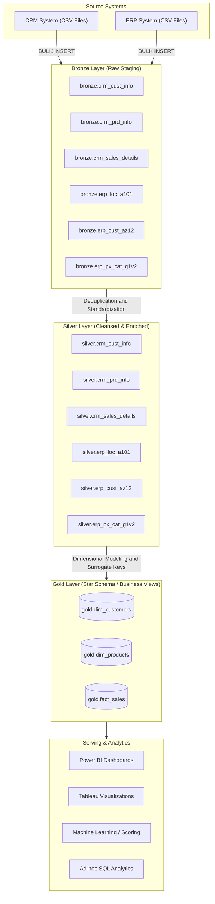
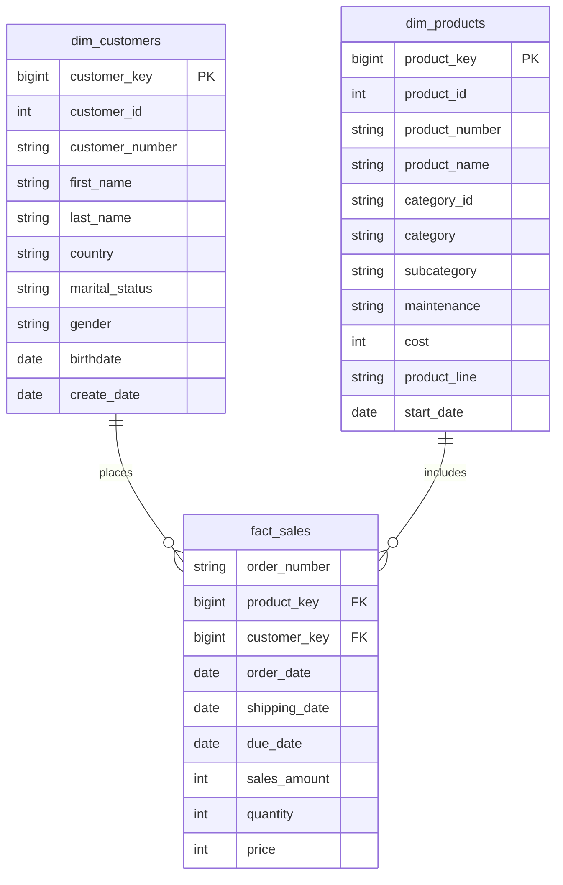

# Data Warehouse Architecture & Design

This document details the architectural blueprint, design principles, and data modeling strategies implemented in this SQL Data Warehouse.

---

## 1. Architectural Pattern: Medallion Architecture

The warehouse is built on the industry-standard **Medallion Architecture**, organizing data into three progressive layers of refinement: **Bronze**, **Silver**, and **Gold**.

---

## 2. The 5 ETL Pipeline Stages

The ingestion, transformation, and analytical serving workflows are structured across five sequential stages:

| Stage | Name | Key Scripts | Description |
| :--- | :--- | :--- | :--- |
| **Stage 1** | **Database & Schema Initialization** | `scripts/init_database.sql` | Establishes the `DataWarehouse` database and provisions isolated schemas (`bronze`, `silver`, `gold`). |
| **Stage 2** | **Bronze Raw Ingestion** | `scripts/bronze/ddl_bronze.sql` `scripts/bronze/proc_load_bronze.sql` | DDL table provisioning and high-performance `BULK INSERT` stored procedure ingestion from CRM and ERP CSV exports. |
| **Stage 3** | **Silver Cleansing & Quality Control** | `scripts/silver/ddl_silver.sql` `scripts/silver/proc_load_silver.sql` | Executes data normalization, window function deduplication, handling of nulls/anomalies, and lineage tracking via `dwh_create_date`. |
| **Stage 4** | **Gold Dimensional Modeling** | `scripts/gold/ddl_gold.sql` | Generates a Kimball-style Star Schema (`dim_customers`, `dim_products`, `fact_sales`) with surrogate keys and active record filtering. |
| **Stage 5** | **Analytics & Quality Verification** | `tests/quality_checks_*.sql` `scripts/gold/analytics_queries.sql` | Comprehensive automated DQ validation suites and high-value analytical SQL queries ready for BI and ML consumption. |

---

## 3. Layer Breakdown & Processing Logic

### Bronze Layer (Raw Staging)
- **Objective**: Rapid, lossless ingestion of raw external data.
- **Characteristics**:
  - Loose data types (e.g., `NVARCHAR(50)`, `INT` for raw representation).
  - No constraints or foreign keys to prevent ingestion failures.
  - Truncate-and-load pattern for repeatable batch pipeline testing.
  - Stored procedure logging with granular duration metrics per table.

### Silver Layer (Cleansed & Conformed)
- **Objective**: Data hygiene, format standardization, and enterprise consolidation.
- **Transformations Applied**:
  - **Deduplication**: Resolves duplicate customer IDs using `ROW_NUMBER() OVER (PARTITION BY cst_id ORDER BY cst_create_date DESC)` to guarantee only the latest record is propagated.
  - **SCD Handling**: Employs `LEAD(prd_start_dt) OVER (PARTITION BY prd_key ORDER BY prd_start_dt) - 1` to dynamically calculate end dates for versioned product catalogs.
  - **String Hygiene**: Strips whitespace via `TRIM()`.
  - **Categorical Harmonization**: Standardizes gender (`'M'`, `'MALE'` &rarr; `'Male'`, `'F'`, `'FEMALE'` &rarr; `'Female'`), marital status (`'S'` &rarr; `'Single'`, `'M'` &rarr; `'Married'`), and country names (`'DE'` &rarr; `'Germany'`, `'US'`, `'USA'` &rarr; `'United States'`).
  - **Anomaly Correction**: Automatically corrects missing or negative sales values (`quantity * ABS(price)`) and derives missing unit prices.
  - **Key Normalization**: Strips legacy system prefixes (`'NAS'`) and removes formatting hyphens (`'-'`) to ensure clean foreign key joins across disparate source systems.

### Gold Layer (Dimensional Modeling / Star Schema)
- **Objective**: Optimized data structure for analytical query speed and self-service BI.
- **Characteristics**:
  - Conformed dimensions: `dim_customers` and `dim_products`.
  - Central fact table: `fact_sales`.
  - Surrogate key generation via `ROW_NUMBER()` for dimensional independence from operational source system key mutations.
  - Active record filtering: Filters out historical product variations using `WHERE prd_end_dt IS NULL`.

---

## 4. Star Schema Data Model (ERD)

---

## 5. Reliability & Error Handling
- **Try-Catch Blocks**: All ETL stored procedures are wrapped in `BEGIN TRY ... BEGIN CATCH` blocks.
- **Detailed Diagnostic Logging**: Errors log `ERROR_MESSAGE()`, `ERROR_NUMBER()`, and `ERROR_STATE()` without crashing silent execution.
- **Audit Lineage**: Every Silver table maintains a `dwh_create_date DATETIME2 DEFAULT GETDATE()` timestamp to support incremental audits and troubleshooting.
